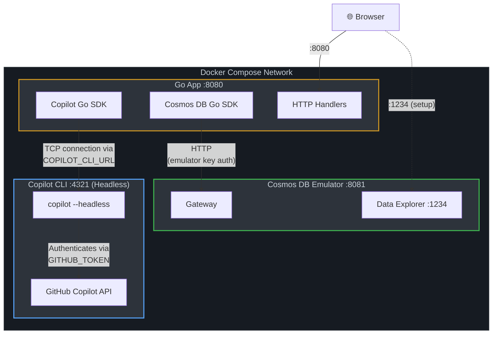
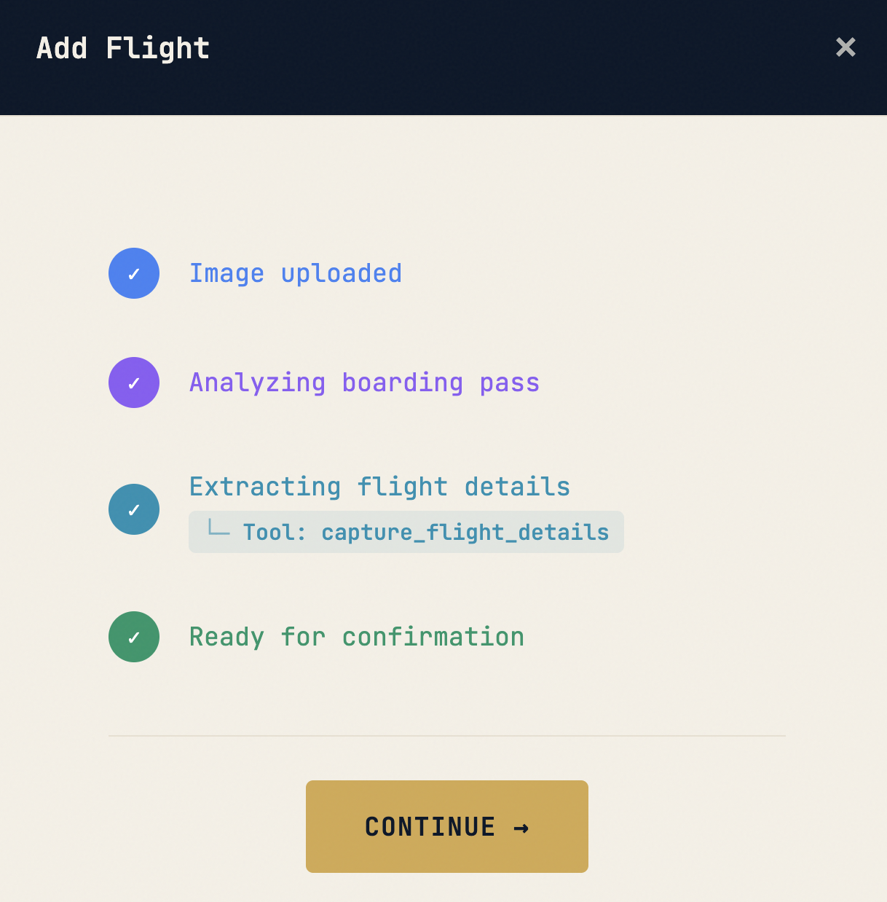
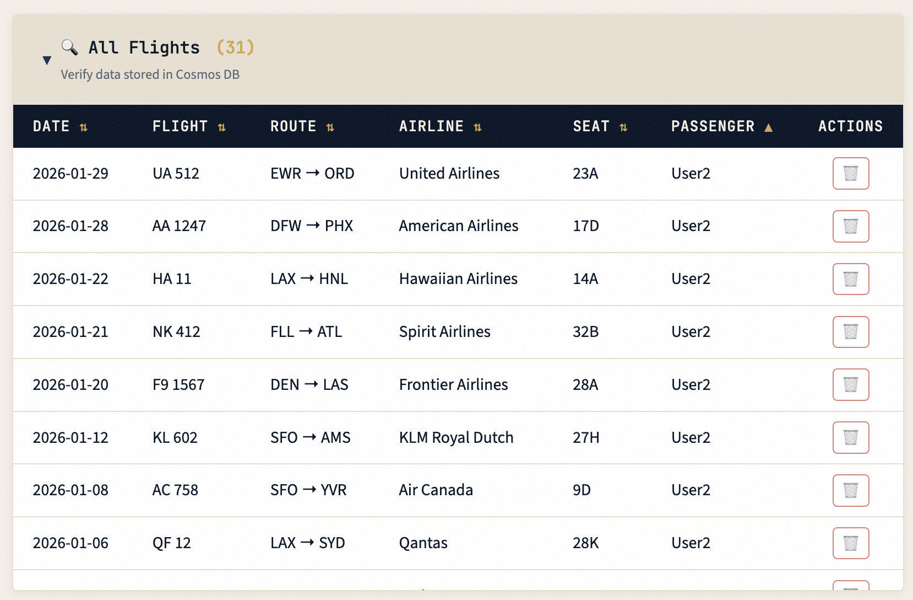
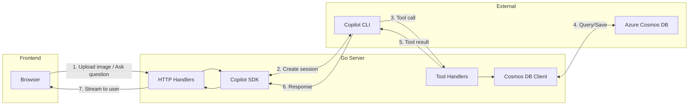

# Flight Log App

The [GitHub Copilot SDK](https://github.com/github/copilot-sdk) lets you embed Copilot's agentic workflows directly into your apps. Available for Python, TypeScript, Go, and .NET — you define agent behavior, Copilot handles the rest.

This is a sample agentic-style application built with GitHub Copilot SDK and [Azure Cosmos DB](https://learn.microsoft.com/en-us/azure/cosmos-db/introduction). It's written in Go and uses Go SDKs for [Cosmos DB](https://pkg.go.dev/github.com/Azure/azure-sdk-for-go/sdk/data/azcosmos) as well as [GitHub Copilot](https://github.com/github/copilot-sdk/tree/main/go).

You can:

- Bulk load sample flight data
- Use natural language queries to retrieve flight history - Copilot generates and runs Cosmos DB SQL queries automatically.
- Upload a boarding pass image - the app uses GitHub Copilot CLI built-in capabilities to extract flight details automatically.

📺 **Watch the demo**:

[](https://youtu.be/uDsfdOG-PjU)

## Prerequisites

1. **[Docker](https://docs.docker.com/get-docker/)** — that's it for Docker Compose (Option A)
2. For running locally without Docker (Options B & C):
   - [Go](https://go.dev/)
   - **GitHub Copilot CLI** - [Install it](https://docs.github.com/en/copilot/how-tos/set-up/install-copilot-cli) and login
   - **Cosmos DB**: [vNext emulator](https://learn.microsoft.com/en-us/azure/cosmos-db/emulator-linux) (Option B) or an Azure Cosmos DB account (Option C)

## Clone the Repository

... and change directory:

```bash
git clone https://github.com/abhirockzz/cosmosdb_copilot_sdk_demo_app

cd cosmosdb_copilot_sdk_demo_app
```

## Option A: Using Docker Compose

Run the entire stack (app, Copilot CLI, and Cosmos DB emulator) with a single command. No local Go or Azure CLI required — just Docker. The Copilot CLI image is built locally from the `@github/copilot` npm package.



The Copilot CLI runs **remotely** in its own container in headless server mode. The Go app connects to it over TCP using the Copilot SDK's `CLIUrl` option — the same SDK API works for both local and remote CLI setups.

### 1. Set Up Environment

The Copilot CLI runs in headless mode inside a container and needs a GitHub token to authenticate.

**Option 1: Using GitHub CLI (recommended)**

If you have the [GitHub CLI](https://cli.github.com/) installed and logged in:

```bash
echo "COPILOT_GITHUB_TOKEN=$(gh auth token)" > .env
```

**Option 2: Using a Personal Access Token**

1. Go to https://github.com/settings/personal-access-tokens/new
2. Under **Permissions**, click "add permissions" and select **Copilot Requests**
3. Generate the token
4. Create the `.env` file:

```bash
echo "COPILOT_GITHUB_TOKEN=your_token_here" > .env
```

### 2. Start Everything

```bash
docker compose up --build
```

This starts three containers:

| Service           | Port           | Description                                |
| ----------------- | -------------- | ------------------------------------------ |
| `cosmos-emulator` | `8081`, `1234` | Cosmos DB vNext emulator                   |
| `copilot-cli`     | `4321`         | GitHub Copilot CLI in headless server mode |
| `app`             | `8080`         | Flight Log Go app                          |

### 3. Create Database and Container

Once the emulator is ready, open the Data Explorer at http://localhost:1234 and create:

- Database: `flightlog`
- Container: `boardingPasses` with partition key `/email`

### 4. Use the App

Open http://localhost:8080 in your browser.

To stop everything:

```bash
docker compose down
```

Skip to [Use the App](#use-the-app) section below.

---

## Option B: Using the Cosmos DB vNext Emulator

The vNext emulator [runs on Linux/macOS/Windows via Docker](https://learn.microsoft.com/en-us/azure/cosmos-db/emulator-linux#running). No Azure account needed.

### 1. Start the Emulator

```bash
docker run -p 8081:8081 -p 1234:1234 mcr.microsoft.com/cosmosdb/linux/azure-cosmos-emulator:vnext-preview
```

### 2. Create Database and Container

Open the Data Explorer at http://localhost:1234 and create:

- Database: `flightlog`
- Container: `boardingPasses` with partition key `/email`

### 3. Run the app

```bash
export USE_EMULATOR=true
export COSMOS_ENDPOINT=http://localhost:8081
export COSMOS_DATABASE="flightlog"
export COSMOS_CONTAINER="boardingPasses"
export PORT="8080" # change if needed

go run main.go
```

Open http://localhost:8080 in your browser.

Skip to [Use the App](#use-the-app) section below.

---

## Option C: Using Azure Cosmos DB

### 1. Create Cosmos DB Resources

Login using Azure CLI:

```bash
az login
```

Then run the following commands to create the necessary resources:

```bash
# Set environment variables (customize these values as needed)
export RG_NAME="flight-log-rg"
export LOCATION="westus2"
export COSMOS_ACCOUNT="flight-log-cosmos"
export COSMOS_DATABASE="flightlog"
export COSMOS_CONTAINER="boardingPasses"

# Create resource group
az group create --name $RG_NAME --location $LOCATION

# Create Cosmos DB account
az cosmosdb create \
  --name $COSMOS_ACCOUNT \
  --resource-group $RG_NAME \
  --kind GlobalDocumentDB

# Create database
az cosmosdb sql database create \
  --account-name $COSMOS_ACCOUNT \
  --resource-group $RG_NAME \
  --name $COSMOS_DATABASE

# Create container
az cosmosdb sql container create \
  --account-name $COSMOS_ACCOUNT \
  --resource-group $RG_NAME \
  --database-name $COSMOS_DATABASE \
  --name $COSMOS_CONTAINER \
  --partition-key-path /email
```

### 2. Assign RBAC Role

```bash
# Get your user object ID
USER_ID=$(az ad signed-in-user show --query id -o tsv)

# Get Cosmos DB account ID
COSMOS_ID=$(az cosmosdb show --name $COSMOS_ACCOUNT --resource-group $RG_NAME --query id -o tsv)

# Assign Cosmos DB Built-in Data Contributor role
az cosmosdb sql role assignment create \
  --account-name $COSMOS_ACCOUNT \
  --resource-group $RG_NAME \
  --role-definition-name "Cosmos DB Built-in Data Contributor" \
  --principal-id $USER_ID \
  --scope $COSMOS_ID
```

### 3. Run the App

```bash
export COSMOS_ENDPOINT="https://${COSMOS_ACCOUNT}.documents.azure.com:443/"
export COSMOS_DATABASE="flightlog"
export COSMOS_CONTAINER="boardingPasses"
export PORT="8080" # change if needed

go run main.go
```

Open http://localhost:8080 in your browser.

---

## Use the App

**Enter any email to login (just for demo purposes)** - This is used as partition key for the flight data

**Load sample data** - Get going quickly with pre-populated flights


**Ask questions** - Use natural language to query flight history


**Add a flight** - Click "Add Flight" and upload/choose a boarding pass image

**Review extraction** - Copilot extracts flight details in real-time



**Save** - Confirm and save to Cosmos DB

**All Flights** - Check all the flights data stored in Cosmos DB



---

## How It Works



### AI-Generated SQL Queries

When you ask a natural language question like *"show me my flights to New York"*, the app uses Copilot to dynamically generate and execute Cosmos DB SQL queries. The AI translates your intent into SQL (e.g., `SELECT * FROM c WHERE c.email = '...' AND c.toAirport = 'JFK'`), runs it against your data, and summarizes the results.

This is a powerful pattern for building conversational data interfaces — but note that in this demo, queries are always scoped to your partition key (email), so users can only access their own flight data.
